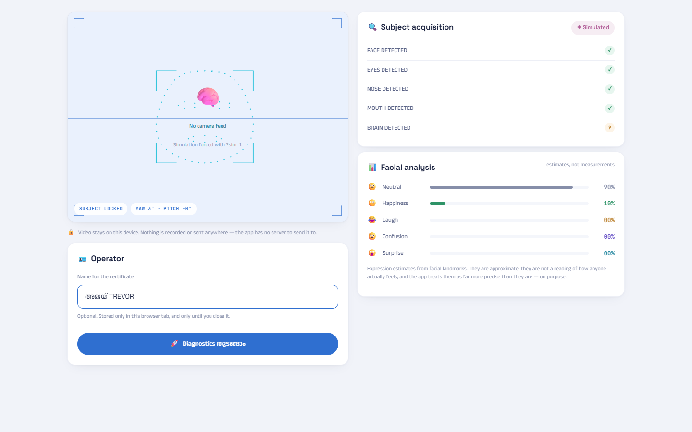


# നിന്റെ തലയിൽ പിണ്ണാക്കാണോ? (PINNAKK OS™) 🎯


## Basic Details
### Team Name: Merge Conflicts


### Team Members
- Team Lead: Ajay Daniel Trevor - IETCU
- Member 2: Trishaa B - IETCU

### Project Description
An unnecessarily advanced brain diagnostic operating system. It reads your webcam, estimates your facial expressions entirely in the browser, and reports — with total scientific confidence — exactly how much പിണ്ണാക്ക് is currently in your തല. It then issues you a certificate about it.

### The Problem (that doesn't exist)
For generations, Malayalis have been accusing each other of having പിണ്ണാക്ക് in their heads. Not once has anyone produced a number. There is no dashboard, no percentage, no downloadable proof. Your amma has been making this diagnosis by eye, unverified, for your entire life.

### The Solution (that nobody asked for)
Real computer vision, pointed at a completely fake problem. A MediaPipe face model tracks 52 facial blendshapes at 20fps, and we feed all of that genuine signal into metrics we invented: Brain CPU, Overthinking %, Social Battery, ചായ Requirement, and your live പിണ്ണാക്ക് level in both percent and kilograms. There is a Task Manager where `Punnakk.exe` cannot be ended, a Reel Lab that measures whether reels are working on you, four games that judge your face, and a Final Report that ends in an officially-sealed certificate telling you not to improve.

## Technical Details
### Technologies/Components Used
For Software:
- TypeScript, HTML, CSS
- React 18, Vite 6
- @mediapipe/tasks-vision (FaceLandmarker — 52 blendshapes + head pose, running on WASM in-browser), Zustand (state), Motion/Framer Motion (animation), Fontsource (self-hosted Anek Malayalam, Space Grotesk, JetBrains Mono), Canvas 2D API (certificate rendering)
- Node.js, Playwright (automated end-to-end verification), Git

For Hardware:
- A webcam (any laptop one will do)
- A തല (required, not included)
- No other hardware — this runs entirely in a browser tab

### Implementation
For Software:
# Installation
```bash
npm install
```
This also downloads the face model (~3.8 MB) into `public/mp/models/` and copies MediaPipe's WASM runtime out of `node_modules`. Both are vendored locally, so the app never depends on a CDN at demo time.

# Run
```bash
npm run dev
```
Then open **http://localhost:5173**.

> ⚠️ The camera needs `localhost` or HTTPS. Opening the dev server over a LAN IP means the browser silently refuses camera access and the app falls back to simulation mode.

No camera, no internet, or hackathon wifi died? Every screen still works in simulation mode — open **http://localhost:5173/?sim=1**. The app says plainly when it is on; invented signals are never passed off as a reading of a real face.

Production build (fully static, deployable anywhere):
```bash
npm run build
```

Automated walkthrough in a real browser — boot to certificate, desktop and mobile:
```bash
npm run smoke
```

### Project Documentation
For Software:

# Screenshots (Add at least 3)
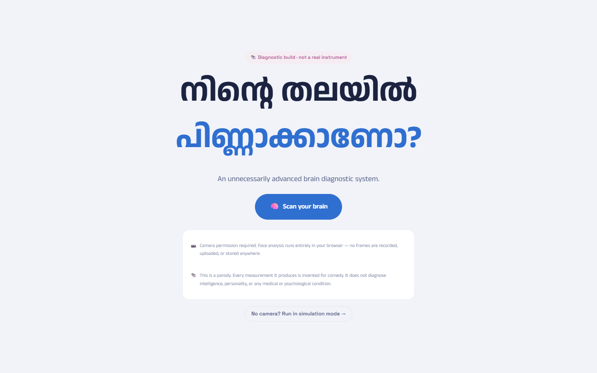
*The landing screen. The question has been asked for generations; this is the first time it comes with a scan button. The camera and parody disclaimers are stated up front, before anything is switched on.*


*Subject acquisition. Live landmark overlay on the webcam feed, a detection checklist that confirms FACE / EYES / NOSE / MOUTH and then hesitates on BRAIN, and live expression estimates. Video never leaves the device.*

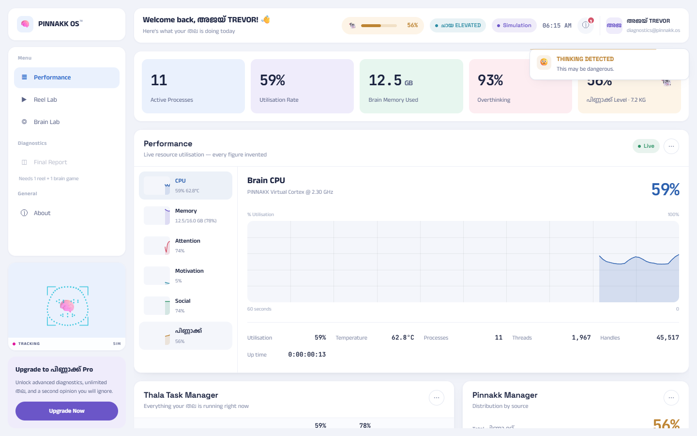
*The main dashboard. Pastel KPI tiles across the top, then a Windows-Task-Manager-style Performance tab with a resource rail, a 60-second trace, and honest-looking readouts for threads, handles and uptime — all of it measuring nothing.*

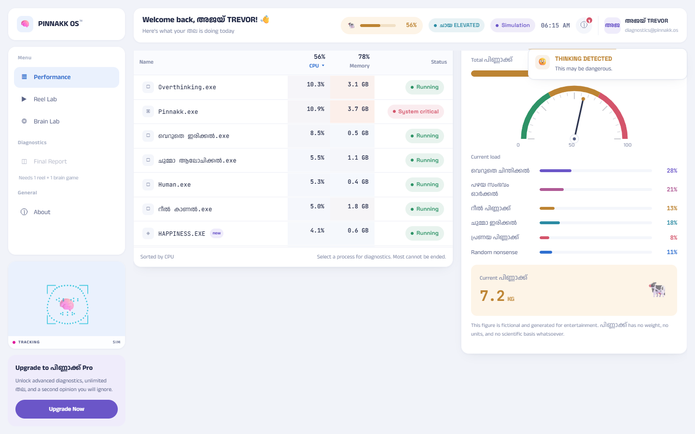
*THALA TASK MANAGER and PINNAKK MANAGER. The CPU column genuinely sums to the headline figure like a real task manager, `Punnakk.exe` sits at SYSTEM CRITICAL, and the പിണ്ണാക്ക് load is broken down by source — റീൽ പിണ്ണാക്ക്, പഴയ സംഭവം ഓർക്കൽ, പ്രണയ പിണ്ണാക്ക് — with a live weight in kilograms.*

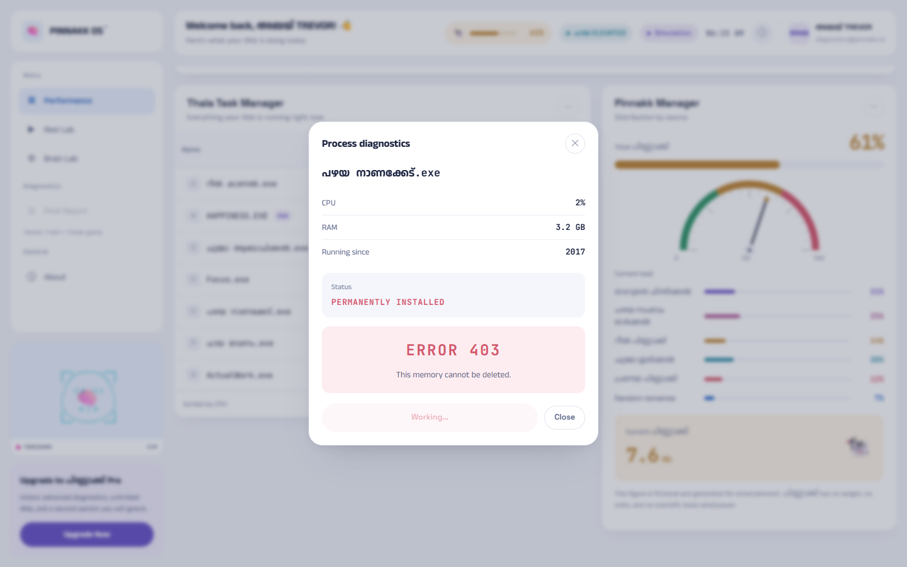
*Attempting to end `പഴയ നാണക്കേട്.exe` (running since 2017). The process spends a few seconds pretending to terminate before admitting `ERROR 403 — This memory cannot be deleted.` Exactly one process in the entire system can actually be ended: `ActualWork.exe`, and ending it raises your പിണ്ണാക്ക്.*

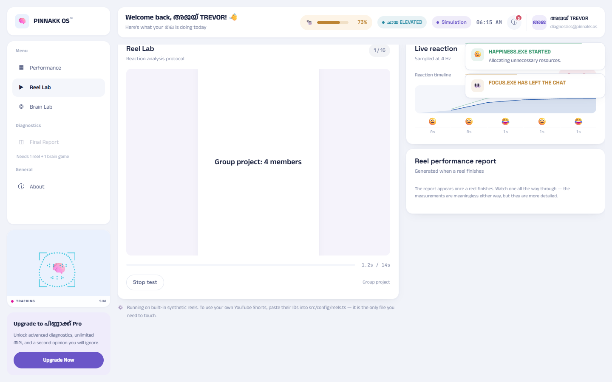
*REEL LAB. A reel plays while your reaction is sampled four times a second, producing a live timeline and a performance report: maximum laugh, attention, smile duration, poker face, and net പിണ്ണാക്ക് change. Ships with 16 built-in Malayalam reels so it needs no internet.*

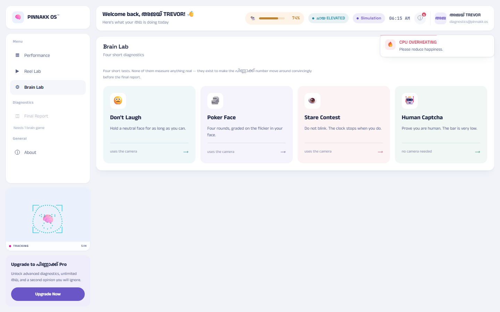
*BRAIN LAB. Four diagnostics: Don't Laugh, Poker Face, Stare Contest (real blink detection), and Human Captcha — where every answer is correct, because the answer is always ALL OF THE ABOVE.*

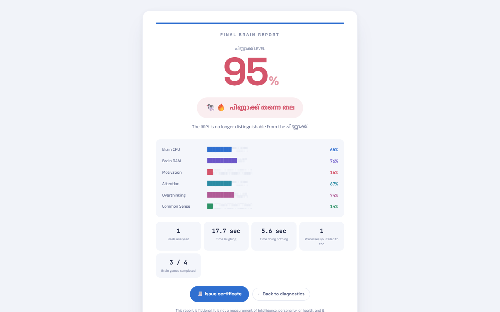
*The FINAL BRAIN REPORT. A dramatic score reveal and a classification ranging from 🧠 തല ക്ലീൻ to 🐄🔥 പിണ്ണാക്ക് തന്നെ തല, with the fictional nature of all of it stated plainly at the bottom.*

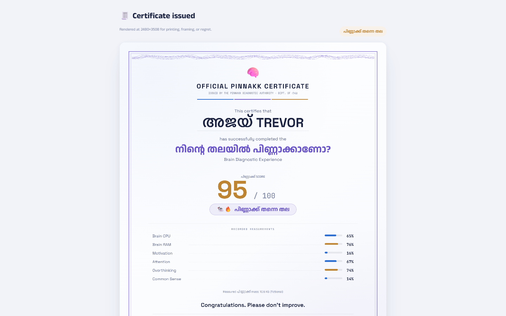
*The certificate — drawn pixel by pixel on a canvas with a guilloché border, an arc-text seal, microtext and a decorative data block. Downloadable as a PNG. It closes with "Congratulations. Please don't improve."*

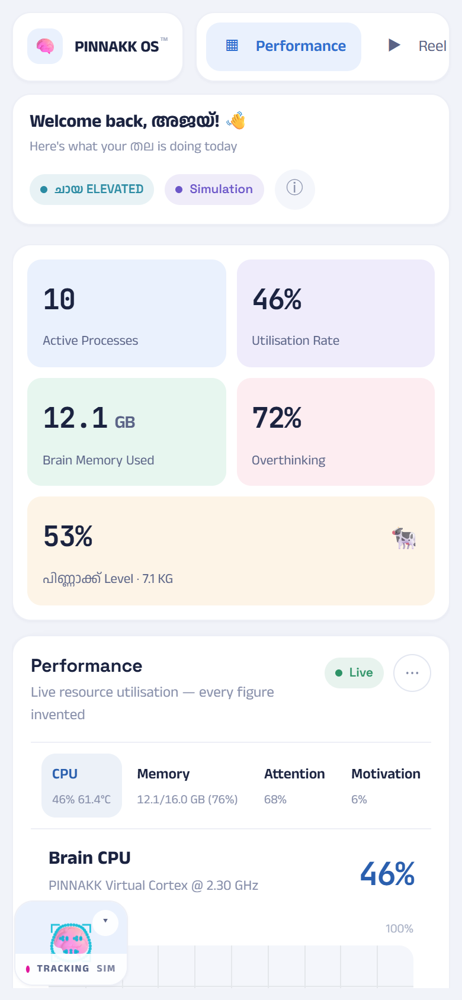
*Runs on a phone too. The sidebar becomes a scrolling strip, the process table drops its Memory column, and the whole app fits a 390px screen — asserted automatically on every test run.*

# Diagrams
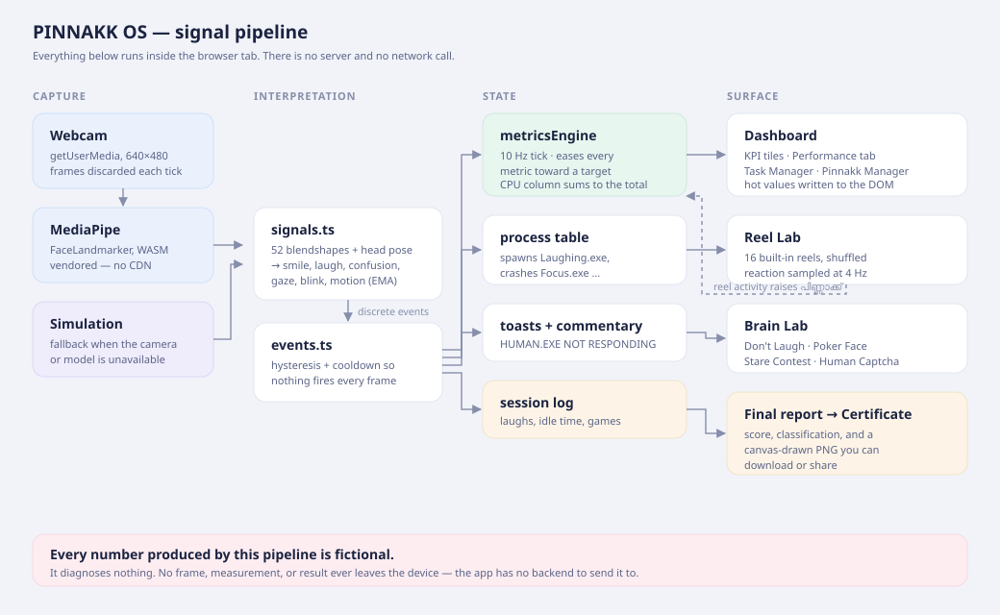
*The signal pipeline. Webcam frames go into MediaPipe and are discarded immediately; 52 blendshapes become smoothed signals, which become discrete events with hysteresis and cooldowns so nothing fires every frame. Those events drive a 10 Hz metrics tick, the process table, the alert toasts and the session log — which finally becomes the report and the certificate. Nothing in this diagram touches a network.*

---
Made with ❤️ at TinkerHub Useless Projects 


